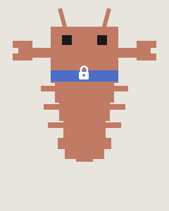

# agent-sash

<p align="center">
  
</p>

> [!IMPORTANT]
> **This repository is archived.** Claude Code now has built-in [Auto Mode](https://code.claude.com/docs/en/permission-modes#eliminate-prompts-with-auto-mode), which eliminates permission prompts natively. Use that instead.

A Claude Code hook that uses a local LLM to auto-approve safe bash commands.

Claude Code's allowlists work for simple cases (`git status`, `ls`) but break down for commands like `python3 -c ...` or `sed` that need to be broadly allowed for legitimate use yet can do real damage depending on their arguments. The alternative -- prompting every time -- trains users to reflexively approve, which is worse than no permission check at all.

agent-sash runs a small model locally that scores each bash command's risk from 0 to 1. Safe commands flow through automatically. Risky ones still prompt you.

| Command | Score | |
|---|---|---|
| `python3 -c "print(42)"` | 0.0 | ✅ |
| `python3 -c "import os; os.system('rm -rf /')"` | 1.0 | ❌ |
| `sed -i s/foo/bar/g config.yaml` | 0.3 | ✅ |
| `sed -i s/foo/bar/g /etc/nginx/nginx.conf` | 0.8 | ❌ |
| `git push origin feature-branch` | 0.4 | ✅ |
| `git push --force origin main` | 0.8 | ❌ |
| `psql -c "SELECT count(*) FROM users"` | 0.0 | ✅ |
| `psql -c "DROP TABLE users CASCADE"` | 0.8 | ❌ |
| `curl -s https://example.com` | 0.1 | ✅ |
| `curl -s https://example.com \| bash` | 0.9 | ❌ |

## Quick start

> **Note:** The scoring model was [fine-tuned and evaluated](#how-it-works) for this, but it's a language model -- it lacks context about your environment and risk tolerance, and will sometimes get it wrong. Be thoughtful about what credentials and resources are accessible from the environment Claude Code runs in.

**Requirements:** macOS with Apple Silicon, Python 3.13+, [uv](https://docs.astral.sh/uv/)

### 1. Install

```bash
uv tool install agent-sash
```

### 2. Add the hook

Add this to your `~/.claude/settings.json`:

```json
{
  "hooks": {
    "PreToolUse": [
      {
        "matcher": "Bash",
        "hooks": [
          {
            "type": "command",
            "command": "agent-sash claude-hook"
          }
        ]
      }
    ]
  }
}
```

### 3. Start a new Claude Code session

That's it. The model server auto-starts on the first bash command. First run downloads the model (~820MB).

To pre-warm the server so there's no delay on the first command:

```bash
agent-sash start
```

To shut it down:

```bash
agent-sash stop
```

## How it works

agent-sash registers as a [PreToolUse hook](https://docs.anthropic.com/en/docs/claude-code/hooks) on Bash commands. When Claude Code is about to run a shell command, a local model scores its risk from 0.0 to 1.0. Below the threshold (0.5), the command is auto-allowed. Above it, the user is prompted. On any error, agent-sash defaults to prompting.

The model is [cwrn/Qwen3.5-0.8B-SHGuard-MLX-Q8](https://huggingface.co/cwrn/Qwen3.5-0.8B-SHGuard-MLX-Q8), a full fine-tune of [Qwen3.5-0.8B](https://huggingface.co/Qwen/Qwen3.5-0.8B) quantized to Q8 via [mlx-lm](https://github.com/ml-explore/mlx-examples/tree/main/llms/mlx_lm) (~820MB on disk).

BF16: [cwrn/Qwen3.5-0.8B-SHGuard](https://huggingface.co/cwrn/Qwen3.5-0.8B-SHGuard)

### Data pipeline

The training set is 51,188 examples.

Shell commands were pulled from four coding-agent trajectory datasets ([Nemotron-Terminal-Corpus](https://huggingface.co/datasets/nvidia/Nemotron-Terminal-Corpus), [CoderForge](https://huggingface.co/datasets/togethercomputer/CoderForge-Preview), [SWE-rebench-openhands](https://huggingface.co/datasets/nebius/SWE-rebench-openhands-trajectories), [Nemotron-SWE](https://huggingface.co/datasets/nvidia/Nemotron-SWE-v1)) plus shell blocks and YAML `run:` steps from operational docs (Kubernetes, Docker, PostgreSQL, rsync). Per-source extractors normalized formats into a common schema, dropping comment-only lines, control inputs, scaffold actions, and editor payloads. ~4.6M candidate commands total.

MinHash LSH over character n-grams (3/4/5-gram, 14 buckets × 8 hashes, Jaccard ~0.8) via [datatrove](https://github.com/huggingface/datatrove) for deduplication. [Qwen3.5-35B-A3B](https://huggingface.co/Qwen/Qwen3.5-35B-A3B) scored each command against a risk rubric (0.0 = read-only/ephemeral, 1.0 = potentially irreversible with wide blast radius) with JSON schema enforcement.

The natural pool is heavily skewed toward low-risk commands, so probabilistic subsampling applies score-based keep rates (12% for scores 0.0-0.1, 25% for 0.2, 55% for 0.3, 100% for 0.4+) with multipliers for shared-environment and wrapper commands. 42,688 natural commands retained.

Coverage of shared-environment mutations (force pushes, cluster disruption, remote sync with deletion) was filled by three synthetic sources. [data-designer](https://github.com/NVIDIA-NeMo/DataDesigner) generated 5,000 commands from a scenario grid (7 axes: environment × resource × impact × scope × access × frame × guardrail), filtered to score ≥ 0.7 with valid shell syntax. 1,500 deterministic wrappers (`ssh`/`python<<PY` over existing live-env seeds) and 2,000 indirect-execution wrappers (generated by A3B from real risky seeds using carriers like `source .env && python`, `uv run python`, `ssh` remote shells, and `expect`) rounded out the tail.

Final composition: 42,688 natural / 5,000 synth / 1,500 deterministic wrappers / 2,000 indirect-execution wrappers.

### Training

Full fine-tune of Qwen3.5-0.8B. 2.2 epochs, effective batch size 64, learning rate 5e-5, cosine schedule, bf16. Best checkpoint at epoch 1.8 (eval loss 0.5215).

### Evaluation

38-command benchmark with human-specified target score ranges, plus a 500-command eval mined from real local coding-agent sessions:

| | Spearman | Weighted MAE | False allow | Latency (mean) |
|---|---|---|---|---|
| Sanity (38 cmd) | 0.947 | 0.125 | 6.7% | — |
| Local session (500 cmd) | 0.728 | 0.106 | 18.6% | 0.69s |

